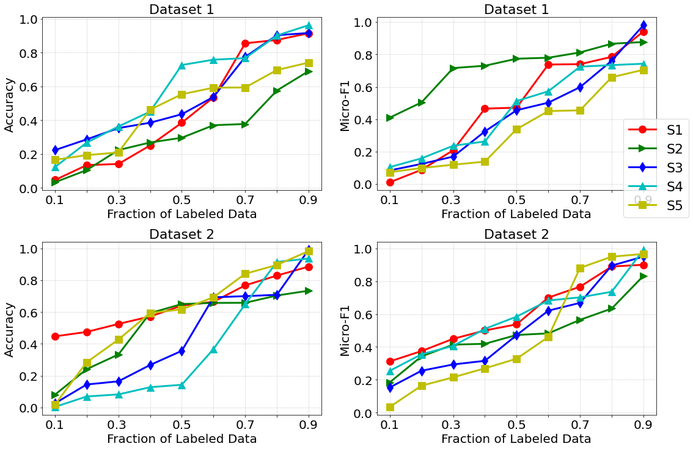

# ToolKit_for_DataScience
A toolkit for data visualization, data loading and converting, and other utilities

**Multiple Line Charts**

**Multiple Bar Charts**

**Multiple Distribution Charts**

**Multiple Box Charts**

**Time Series Visualization**

**Correlation Heatmap**

**Feature Importance**

**Missing Values in each Column**

