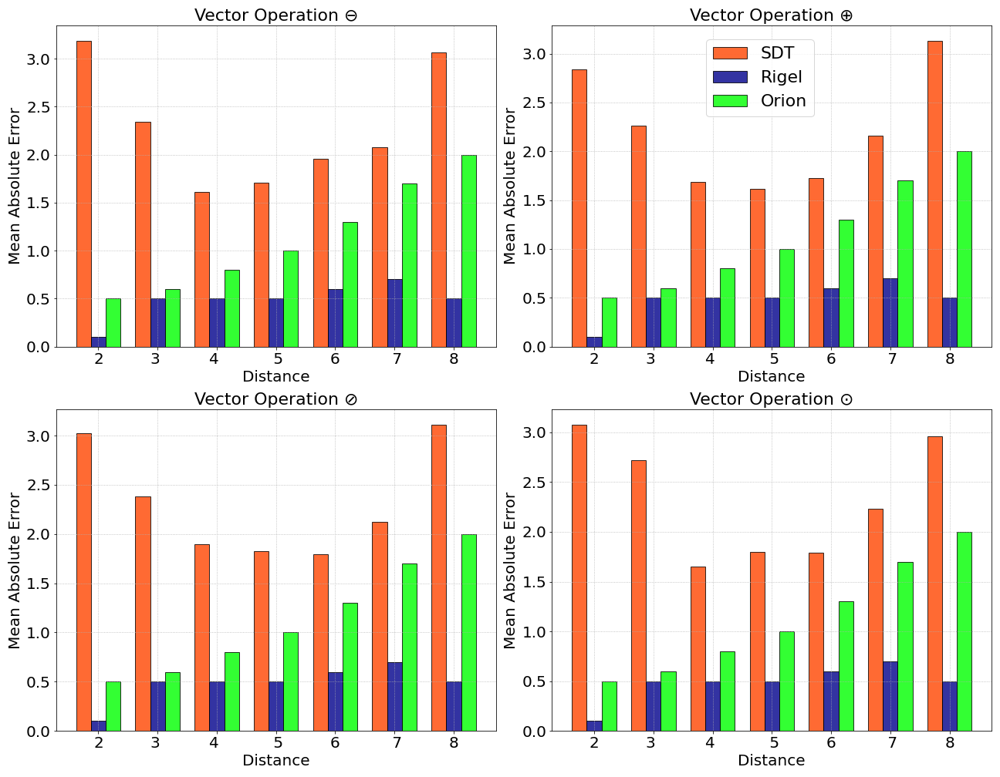

# ToolKit_for_DataScience
A toolkit for data visualization, data loading and converting, and other utilities. 

**Multiple Line Charts**

**Multiple Bar Charts**

Time series dataset from [Kaggle](https://www.kaggle.com/datasets/nphantawee/pump-sensor-data) 
**Time Series Visualization**

**Correlation Heatmap**

**Multiple Distribution Charts**

**Multiple Box Charts**

**Feature Importance**

**Missing Values in each Column**

